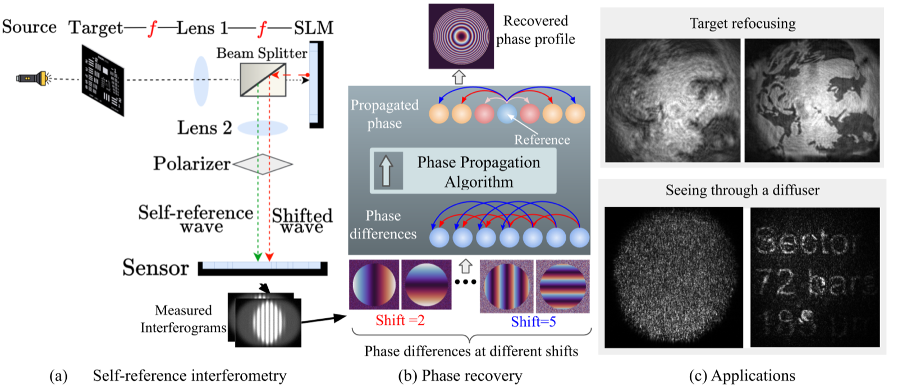

# Provable and Robust Wavefront Sensing via Self-Reference Interferometry

**ECCV 2026 · Oral**

Nebiyou Yismaw<sup>1</sup>, Vishwanath Saragadam<sup>1</sup>, Aswin C. Sankaranarayanan<sup>2</sup>, M. Salman Asif<sup>1</sup>

<sup>1</sup>University of California, Riverside &nbsp;&nbsp;<sup>2</sup>Carnegie Mellon University

[Paper (arXiv)](https://arxiv.org/abs/2604.03564) · Code coming soon




Code will be available soon.

## Citation

If you find this work useful, please cite it. We will update this citation
once the ECCV proceedings version is available.

```bibtex
@article{yismaw2026provable,
  title   = {Provable and Robust Wavefront Sensing via Self-Reference Interferometry},
  author  = {Yismaw, Nebiyou and Saragadam, Vishwanath and Sankaranarayanan, Aswin C and Asif, M Salman},
  journal = {arXiv preprint arXiv:2604.03564},
  year    = {2026}
}
```
